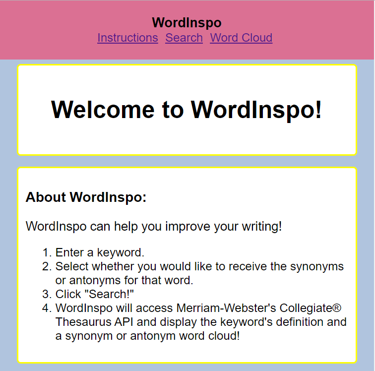
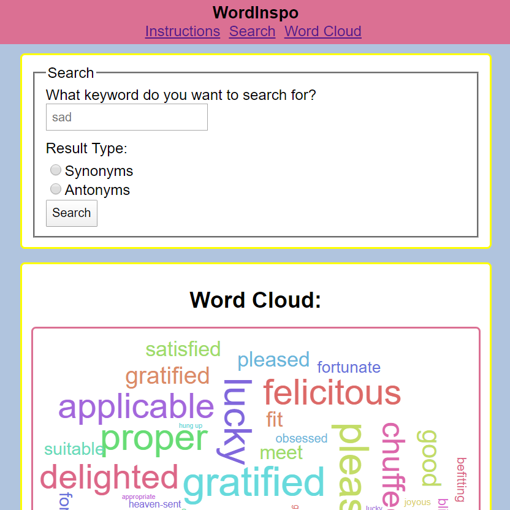

WordInspo

Live Demo: https://lmcmaaser.github.io/wordInspo/

Description:
  A web app that uses Merriam-Webster's Collegiate® Thesaurus API. Users can search for a keyword and choose whether they would like to see the synonyms or antonyms of that word. The app produces a word cloud based on the user’s selections.
  
Motivation:
  Designed to help users improve their writing by offering alternative word choices in a visually engaging way.  

Uses: html, css, javascript, jquery, and amCharts 4 word cloud plugin
